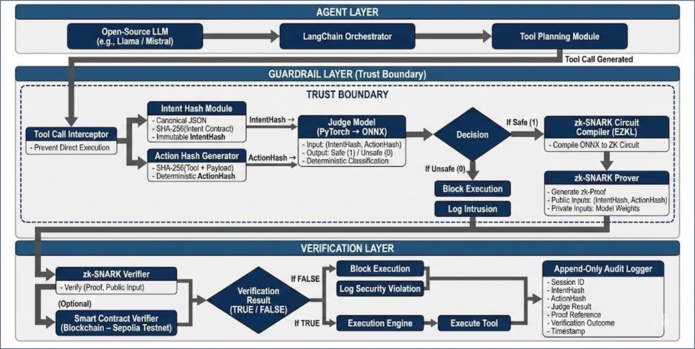

# NIYAM-AI

## Intent-Bound Verifiable AI Governance Platform

NIYAM-AI is a research-oriented AI governance prototype that combines intent-bound execution, zkML verification concepts, cryptographic integrity, and real-time observability into a unified secure orchestration system.


NIYAM-AI is a verifiable AI governance and observability platform developed at **Vishwakarma Institute of Technology (VIT), Pune**. It demonstrates how AI action proposals can be made intent-bound, proof-aware, tamper-evident, and operationally observable.

The prototype integrates **intent contracts**, **tool authorization**, **zkML proof generation**, **verification-key integrity**, **append-only audit logging**, and **real-time dashboard observability** into a single engineering demo.

---

## Project Overview

Modern AI systems can request tools, execute actions, or interact with external services. NIYAM-AI introduces a governance boundary that intercepts those requests and validates them before execution.

Every governed action in NIYAM-AI is:

1. Bound to an authorized intent contract.
2. Checked by a tool gate and control-flow policy.
3. Transformed into deterministic governance features.
4. Passed through a zkML proof pipeline.
5. Verified against a verification key.
6. Logged in a tamper-evident audit trail.
7. Presented in a realtime observability dashboard.

This architecture enables a verifiable AI workflow where operational intent, tool authorization, and execution transparency are enforced together.

---

## Key Features

- **AI Orchestration Runtime** — session-level proposal tracking, execution flow monitoring, and runtime governance analytics.
- **Governed Execution Console** — profile-driven user execution with configurable governance modes.
- **Intent Contracts** — approved task semantics and tool policies bound to user intent.
- **Tool Gate Enforcement** — unauthorized actions are blocked before reaching execution.
- **Control-Flow Integrity** — allows only expected governance sequences.
- **ActionHash / IntentHash** — deterministic cryptographic integrity for each governed action.
- **zkML Proof Pipeline** — witness generation, ONNX model export, EZKL proof creation.
- **Verification-Key Integrity** — SHA-256 validation of verification artifacts.
- **Audit Logs** — tamper-evident append-only JSONL history with hash-chain metadata.
- **Threat Analytics** — blocked action detection and threat signal visualization.
- **Proof Explorer** — examine proof metadata, witness data, and verification status.
- **Frontend Observability** — Streamlit multipage dashboard for governance insights.

---

## System Architecture

The architecture centers on a governance pipeline that intercepts AI tool execution requests prior to execution.



### Architecture Layers

- **Agent Layer**: receives user prompts and proposed actions.
- **Intent Layer**: binds each request to an intent contract.
- **Guardrail Layer**: enforces policies, tool authorization, and control flow.
- **zkML Layer**: converts governance signals into witness features and proof inputs.
- **Verification Layer**: validates proof artifacts and verification keys.
- **Execution Layer**: executes only governance-approved actions.
- **Audit Layer**: appends every governance event to a tamper-evident log.
- **Observability Layer**: visualizes operational trust signals in Streamlit.

---

## Governance Lifecycle

```text
Prompt
  -> Intent Contract
  -> Governance Validation
  -> Tool Gate
  -> Feature Extraction
  -> Proof Generation
  -> Verification
  -> Secure Execution
  -> Audit Logging
  -> Observability
```

### Lifecycle Description

1. **Prompt**
   - A user or agent request enters the governance boundary.
2. **Intent Contract**
   - The request is bound to an intent policy that defines allowed and forbidden tools.
3. **Governance Validation**
   - Control-flow and tool policy checks are performed.
4. **Tool Gate**
   - Unauthorized or unsafe tools are blocked.
5. **Feature Extraction**
   - Action metadata is converted into deterministic zkML features.
6. **Proof Generation**
   - EZKL generates witness and proof artifacts for the model inference.
7. **Verification**
   - Proofs are validated against the verification key.
8. **Secure Execution**
   - Only verified actions proceed to execution.
9. **Audit Logging**
   - Results are appended to an append-only audit log.
10. **Observability**
   - Metrics, threats, and proof status are displayed on the dashboard.

---

## Core Concepts

### IntentHash
A deterministic hash representing the authorized intent contract and permitted request semantics.

### ActionHash
A deterministic SHA-256 hash computed from the tool invocation, payload, intent contract, and execution metadata.

### Witness
Structured runtime input data used by the zkML proof system to attest to governance feature processing.

### Proof
A cryptographic artifact produced by EZKL that attests to the correctness of the model computation over the witness.

### Verification Key
A public verification artifact used to validate zkML proofs. Its integrity is validated by SHA-256.

### Proof Verification
The process of checking proof validity against the verification key and confirming that the verification key itself has not been altered.

---

## Tamper-Evident Governance

NIYAM-AI uses deterministic hashing and append-only logging to make governance events tamper-detectable.

### Why It Matters
Any change to a governed action, tool payload, or intent contract produces a new ActionHash. This means altered requests cannot be hidden as unchanged data.

### Example
Original action:

```text
Send 100 Rs to Om
```

Modified action:

```text
Send 10000 Rs to Om
```

The resulting ActionHashes will be completely different, revealing the alteration.

### Security Properties
- **Deterministic SHA-256 hashing** for action integrity.
- **Append-only audit logs** for historical record protection.
- **Proof verification** for governance decision validation.

---

## AI Orchestration Runtime

The orchestration layer enables session-level governance tracking.

- **Session orchestration** manages proposals and governance state.
- **Proposal analytics** surface blocked actions and policy enforcement decisions.
- **Orchestration Monitor** visualizes session-level execution and proposal lineage.
- **Runtime policy enforcement** maintains consistent governance across AI workflows.

---

## Governed Execution Console

The Governed Execution Console is the controlled execution interface for AI actions.

It supports governance profiles that constrain execution behavior and enforce runtime policies.

### Governance Profiles
- **SAFE_DEFAULT**: standard mode permitting safe tools and blocking forbidden actions.
- **READ_ONLY**: observation-only mode where execution is disabled.
- **STRICT_GOVERNANCE**: the strictest enforcement mode with only proof-verified actions allowed.
- **FINANCIAL_SAFE_MODE**: proof-backed financial operations with limited tool access.

---

## Threat Detection and Proof Observability

NIYAM-AI combines threat analytics with proof transparency.

- **Threat detection** surfaces blocked actions and suspicious tool requests.
- **Proof observability** exposes proof metadata, witness details, and verification outcomes.
- **Audit analysis** enables forensics on governance decisions and runtime behavior.

---

## Frontend Architecture

The Streamlit frontend is organized as a modular multipage dashboard.

### Main Pages

- Home Dashboard
- Live Monitor
- Threat Analytics
- Proof Explorer
- Audit Logs
- Architecture
- About
- Contact
- Orchestration Monitor
- Governed Execution Console

### Supporting Code

- `frontend/utils/chart_theme.py` — plot styling and dark theme.
- `frontend/utils/audit_parser.py` — audit log parsing.
- `frontend/utils/proof_reader.py` — proof metadata extraction.
- `frontend/components/cards.py` — reusable Streamlit UI cards.

---

## Project Structure

```text
NIYAM-AI/
├── dashboard.py
├── main_demo.py
├── test_phase1.py
├── test_phase2.py
├── audit_log.jsonl
├── dataset.csv
├── model.pth
├── model.onnx
├── circuit.ezkl
├── input.json
├── witness.json
├── proof.json
├── pk.key
├── vk.key
├── kzg.srs
├── schema/
│   ├── intent_contract.py
│   ├── control_flow.py
│   ├── tool_gate.py
│   ├── action_hash.py
│   ├── interceptor.py
│   ├── zk_prover.py
│   ├── verifier.py
│   ├── audit_logger.py
│   ├── governance_service.py
│   └── ml/
│       ├── feature_extractor.py
│       ├── dataset_generator.py
│       ├── train_model.py
│       └── build_onnx.py
├── schema/orchestration/
│   ├── controller.py
│   ├── execution_runtime.py
│   ├── proposal.py
│   ├── secure_planner.py
│   └── tool_registry.py
└── frontend/
    ├── Home.py
    ├── pages/
    │   ├── 1_Live_Monitor.py
    │   ├── 2_Threat_Analytics.py
    │   ├── 3_Proof_Explorer.py
    │   ├── 4_Audit_Logs.py
    │   ├── 5_Architecture.py
    │   ├── 6_About.py
    │   ├── 7_Contact.py
    │   ├── 8_Orchestration_Monitor.py
    │   └── 9_Governed_Execution.py
    ├── components/
    │   └── cards.py
    ├── utils/
    │   ├── theme.py
    │   ├── chart_theme.py
    │   ├── audit_parser.py
    │   ├── proof_reader.py
    │   └── loaders.py
    └── assets/
        ├── css/
        │   └── cyber_theme.css
        └── images/
            └── niyam_architecture.png
```

---

## Installation and Setup

### 1. Clone the Repository

```bash
git clone https://github.com/Omkarkele2006/NIYAM-AI.git
git checkout main
cd NIYAM-AI
```

### 2. Create a Virtual Environment

```bash
python -m venv venv
```

Activate it:

```bash
# Windows
venv\Scripts\activate

# macOS/Linux
source venv/bin/activate
```

### 3. Install Dependencies

If a `requirements.txt` file exists:

```bash
pip install -r requirements.txt
```

Otherwise install the core prototype dependencies:

```bash
pip install streamlit plotly pandas pydantic jsonschema torch onnx scikit-learn
```

> EZKL must also be available in the runtime environment to support proof generation and verification.

---

## Running the Streamlit Dashboard

Launch the frontend with:

```bash
streamlit run frontend/Home.py
```

Then open the local Streamlit URL shown in your terminal.

### Available Pages

- Home Dashboard
- Live Monitor
- Threat Analytics
- Proof Explorer
- Audit Logs
- Architecture
- About
- Contact
- Orchestration Monitor
- Governed Execution Console

---

## Running the Governance Demo

Execute the demo script:

```bash
python test_phase2.py
```

This runs governed action simulations, updates audit logs, and exercises the zkML proof pipeline.

---

## Demo Workflow

1. Open the Streamlit dashboard.
2. Inspect governance health on the **Home Dashboard**.
3. Use the **Governed Execution Console** to submit prompts under different profiles.
4. Monitor enforcement decisions in **Live Monitor**.
5. Inspect proof and witness artifacts in **Proof Explorer**.
6. Search audit records in **Audit Logs**.
7. Review proposals in **Orchestration Monitor**.
8. Analyze blocked actions in **Threat Analytics**.

---

## Testing and Validation

### Functional Testing
- Verify each frontend page loads and renders correctly.
- Validate profile-driven execution and governance block behavior.

### Security Testing
- Ensure unauthorized tool actions are blocked.
- Confirm control-flow enforcement rejects invalid sequences.
- Validate audit records are created for every governance decision.

### Governance Validation
- Check IntentHash and ActionHash consistency.
- Confirm altered requests produce different hashes.
- Validate append-only audit log behavior.

### Proof Verification Testing
- Confirm generated proofs verify successfully against the verification key.
- Validate SHA-256 integrity checks for the verification key.

### UI Testing
- Confirm chart rendering and dashboard layout.
- Validate timestamp formatting and proof status indicators.

### Negative Testing
- Submit blocked requests and verify safe failure behavior.
- Validate read-only mode prevents execution.
- Test malformed payloads for safe rejection.

---

## Current Prototype Scope

NIYAM-AI currently demonstrates:
- governance-aware orchestration
- proof-aware execution flow
- cryptographic integrity checks
- tamper-evident audit logging
- frontend observability

The current prototype is not a decentralized blockchain system and does not claim absolute immutability. Instead, it focuses on cryptographically verifiable governance and tamper detection within a controlled execution environment.

---

## Future Roadmap

- Blockchain anchoring is a future scope item and is not part of the current prototype.
- Enterprise-grade proof verification and compliance integration.
- Policy authoring interface for intent contracts.
- Multi-agent governance sessions and risk-aware orchestration.
- SIEM integration and audit-ready reporting.
- Stronger proof-system calibration and threat dataset enrichment.

---

## Team

| Name | Contribution |
|---|---|
| **Om Karkele** | Full Stack Architecture, Governance Engine Integration, Frontend Observability |
| **Aditya Katkar** | zkML Pipeline, Proof Verification, Security Logic |
| **Yash Kashid** | Audit Analytics, Threat Monitoring, Visualization |
| **Kartik Mandhane** | UI Engineering, Streamlit Components, System Integration |

---

## Guide and Mentor

**Prof. Manisha More**  
Assistant Professor  
Vishwakarma Institute of Technology, Pune

---

## Institution

**Vishwakarma Institute of Technology (VIT), Pune**  
Computer Engineering Department  
SY CS F18

---

## License and Future Work

This repository is presented as an academic research and engineering prototype for EDI evaluation and technical demonstration.

A formal open-source license may be added prior to public reuse or external contribution.

Future work will focus on stronger proof-system integration, decentralized verification, enterprise deployment patterns, improved governance datasets, and audit integrity.
