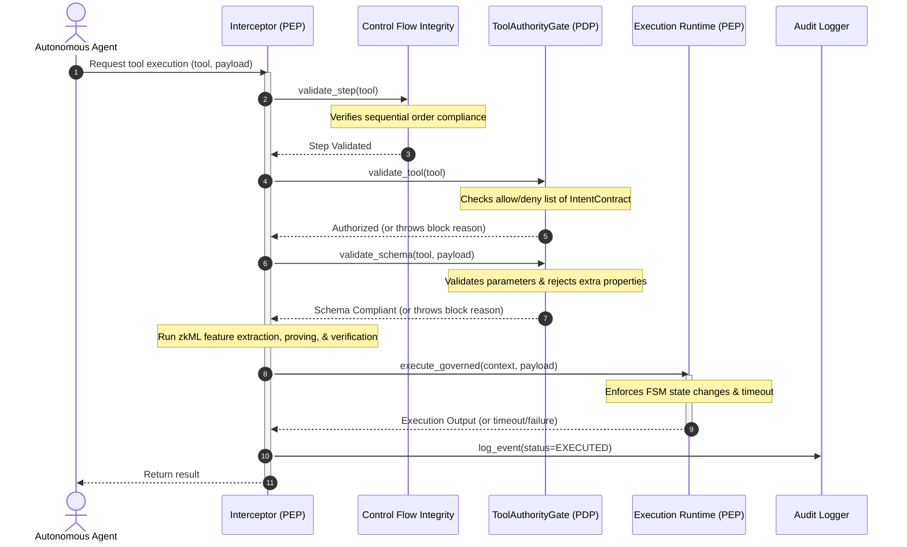
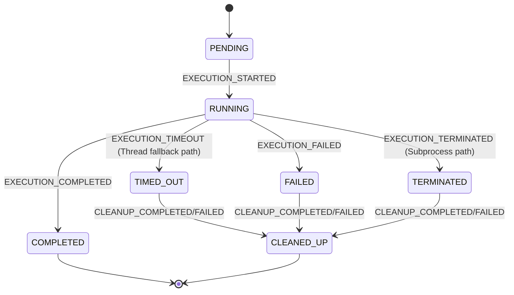

# NIYAM-AI Platform Architecture Overview

NIYAM-AI is a secure, verifiable governance platform designed to intercept, analyze, prove, verify, and log autonomous AI tool actions. It prevents prompt injection attacks or code bugs from bypassing intent restrictions by applying defense-in-depth policy verification and zero-knowledge Machine Learning (zkML) proofs.

---

## Architecture Blueprint

The system governs executions through a sequence of sequential layers before the final action is allowed to proceed:

```text
Prompt
  -> Intent Contract (Checks capability boundaries, matches session)
  -> Control Flow Integrity (Asserts step order compliance)
  -> Tool Gate (Checks against allowed/forbidden lists)
  -> zkML Pipeline (Extracts features, runs inference, generates proof)
  -> Verifier (Checks VK SHA-256 and verifies ZK-SNARK proof)
  -> Execution Runtime (Handles thread isolation, timeout, and cleanup)
  -> Audit Logger (Logs event context to append-only hash chain)
```

---

## Core Components

### 1. Intent Contract
*   **File Location**: [intent_contract.py](file:///c:/IMP/VIT/SY/SEM_2/EDI/NiyamAI-Proj-Code-Original/schema/intent_contract.py)
*   **Description**: Defines what capabilities (allowed tools) and restrictions (forbidden tools) are bound to a specific agent execution session.
*   **Security Properties**:
    *   **Post-Seal Immutability**: Transitioning list structures to immutable tuples using an overridden `__setattr__` block once sealed. Any subsequent mutation attempt triggers a runtime crash.
    *   **IntentHash**: Generates a deterministic SHA-256 hash of the sorted policy list, serving as a unique ID representing the approved policy configuration.

### 2. Tool Gate
*   **File Location**: [tool_gate.py](file:///c:/IMP/VIT/SY/SEM_2/EDI/NiyamAI-Proj-Code-Original/schema/tool_gate.py)
*   **Description**: The Tool Gate enforces the system's boundary defense checks through two distinct verification sub-layers:
    *   **Authorization Layer**: Validates tool names against the active `IntentContract`. Checks that the tool is listed under `allowed_tools` and is absent from `forbidden_tools`.
    *   **Schema Validation Layer**: Validates inputs using strict `jsonschema` payload validations. If a parameter doesn't meet defined ranges, constraints, or types, or carries unexpected additional fields (`additionalProperties: False`), validation fails.
*   **Defense Posture**:
    *   **Default-Deny for Missing Schemas**: If a tool is called that does not have a corresponding schema definition mapped, it is blocked automatically.
    *   **Structured Errors**: Validation errors raise a `GovernanceValidationError` formatting detailed contexts (tool, status, and precise failure message) into standard JSON strings for parsing or logging.

### 3. Interceptor
*   **File Location**: [interceptor.py](file:///c:/IMP/VIT/SY/SEM_2/EDI/NiyamAI-Proj-Code-Original/schema/interceptor.py)
*   **Description**: The central policy enforcement point (PEP) that coordinates the execution check sequence.
*   **Responsibility**: Intercepts requested tool calls, coordinates CFI, Tool Gate authorization and schema checks, zkML feature extraction, proof generation, and verification before dispatching to the execution runtime. In case of verification failure, it flags security alerts and logs the blocked action.

### 4. zkML Pipeline
*   **Files**: 
    *   [feature_extractor.py](file:///c:/IMP/VIT/SY/SEM_2/EDI/NiyamAI-Proj-Code-Original/schema/ml/feature_extractor.py) (Extracts 8 normalized feature signals including length, risk indexes, keyword jailbreaks, and injection tokens).
    *   [zk_prover.py](file:///c:/IMP/VIT/SY/SEM_2/EDI/NiyamAI-Proj-Code-Original/schema/zk_prover.py) (Compiles feature values, calls EZKL for witness parsing, and generates SNARK proof files).
*   **Description**: Converts prompt parameters and metadata into deterministic float representations. It generates a cryptographic proof attesting to correct ML-inference validation without relying on unproven claims.

### 5. Verifier
*   **File Location**: [verifier.py](file:///c:/IMP/VIT/SY/SEM_2/EDI/NiyamAI-Proj-Code-Original/schema/verifier.py)
*   **Description**: Checks proof validity against the compiled verification key `vk.key`.
*   **Integrity Defense**: Before running EZKL verification, it checks the SHA-256 hash of `vk.key` against a trusted, hardcoded hash. This prevents attackers from bypassing ZK validation by swapping the verification key.

### 6. Execution Runtime
*   **File Location**: [execution_runtime.py](file:///c:/IMP/VIT/SY/SEM_2/EDI/NiyamAI-Proj-Code-Original/schema/orchestration/execution_runtime.py)
*   **Description**: The Isolated Execution Runtime managing the approved execution steps.
*   **Key Controls**:
    *   **FSM State Transitions**: Enforces logical lifecycle transitions (`PENDING` -> `RUNNING` -> `COMPLETED` / `FAILED` / `TERMINATED` -> `CLEANED_UP`).
    *   **Timeout Handling**: Runs executions inside the Process Isolation Layer (`SubprocessSandboxExecutor`), allowing clean process termination to prevent zombie execution loops.
    *   **Failsafe Cleanups**: Triggers custom, tool-specific rollback routines in case of timeouts, execution termination, or execution errors.

### 7. Audit Logger
*   **File Location**: [audit_logger.py](file:///c:/IMP/VIT/SY/SEM_2/EDI/NiyamAI-Proj-Code-Original/schema/audit_logger.py)
*   **Description**: Writes structured execution and interception records to an append-only JSONLines database (`audit_log.jsonl`).
*   **Hash Chaining**: Implements a cryptographic chain where each entry logs the hash of the preceding line. On startup, it reads the last valid line to resume the chain, guaranteeing chronological logging and detecting deletion or tampering.

---

## Governance Validation Flow Sequence

The sequence below illustrates the validation flow coordinated by the `Interceptor` when a tool invocation is requested:



---

## Execution Containment & Process Isolation Layer

To protect the host process from unverified tool behavior, NIYAM-AI implements an **Execution Containment Layer** structured as follows:

```mermaid
graph TD
    subgraph Execution Containment Layer
        Runtime[GovernedExecutionRuntime (Isolated Execution Runtime)]
        SandboxExec[Sandbox Executor (Implementation Layer)]
        SubprocExec[SubprocessSandboxExecutor (Process Isolation Layer - Preferred)]
        ThreadExec[ThreadSandboxExecutor (Fallback Containment)]

        Runtime --> SandboxExec
        SandboxExec --> SubprocExec
        SandboxExec --> ThreadExec
    end
```

### Process Isolation Layer
Tool execution is isolated from the parent interpreter using **process isolation**. The runtime spawns a separate OS process via Python's `multiprocessing` to isolate:
1.  **Memory Space**: Prevents tool callables from directly accessing or mutating global interpreter states, database connections, keys, or sealed contracts in the parent process.
2.  **Resource Containment**: Enables clean parent-directed termination (`.terminate()` / `.kill()`) if the execution exceeds the timeout limit, preventing lingering zombie execution threads in the host system.

### Execution State Transitions
The lifecycle of a single tool execution attempt is managed as a finite state machine (FSM) enforcing safe transition sequences:



### Threat Model & Current Limitations
While the current Process Isolation Layer isolates memory and enables timeout termination, it does not constitute a full operating-system-level sandbox:

*   **Current Limitations**:
    *   *Shared OS Namespace*: The isolated subprocess still shares the host machine's network stack, local filesystem, and environment variables. If a malicious tool attempts disk I/O or network requests, standard process isolation does not block these OS-level calls automatically unless handled by OS permissions.
    *   *Serialization (Pickling) Constraints*: Callables must be pickleable to be passed to a subprocess. Local lambdas, dynamically generated nested helper functions, and unpickleable objects trigger fallback to `ThreadSandboxExecutor` (which runs in the parent memory space).
*   **Future Opportunities for Stronger Sandboxing**:
    *   *Virtualization*: Packaging tools in gVisor, WebAssembly (Wasm) runtimes, or MicroVMs (e.g., Firecracker) to restrict access to network, system calls, and the filesystem.
    *   *Subprocess Jail/Chroot*: Confining process filesystem root directories and running under unprivileged system users.
    *   *Serialization Upgrades*: Utilizing serialization frameworks like `dill` or `pathos` to decrease pickling failures.
